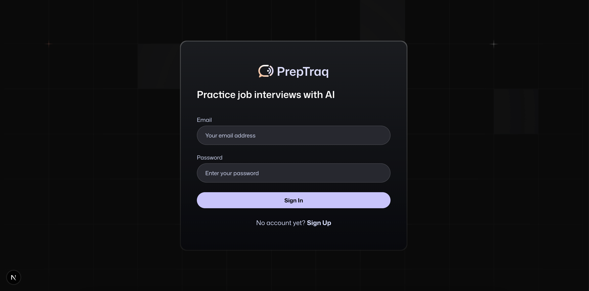
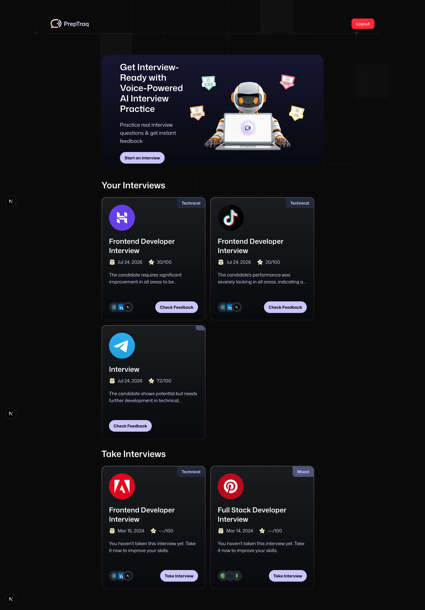
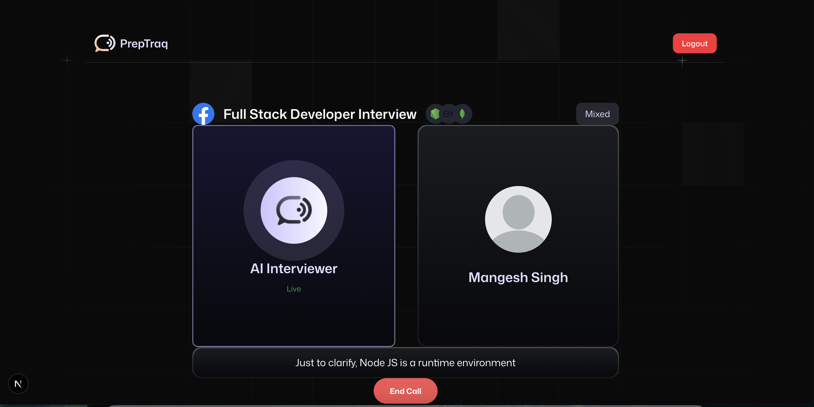
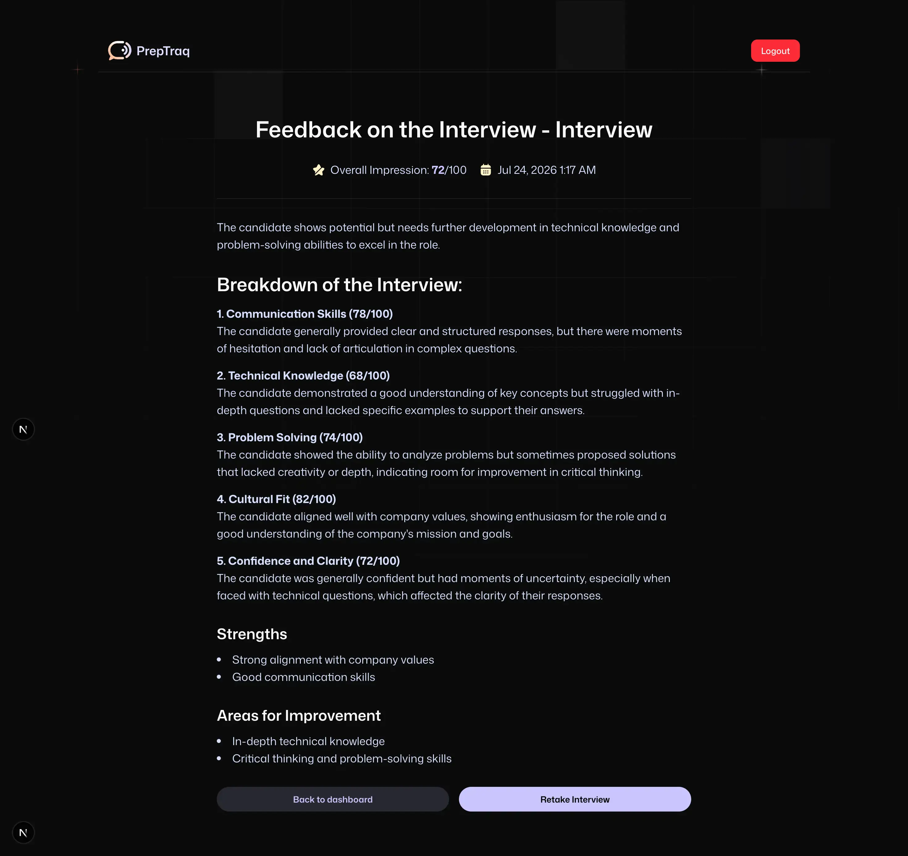

# PrepTraq — AI Interview Buddy 🎙️

Practice real interviews with a voice AI agent, and get instant, structured feedback on how you did.

PrepTraq lets you have a real spoken conversation with an AI interviewer, then reviews your transcript and scores you across multiple categories — just like a real mock interview session, minus the scheduling hassle.



---

## ✨ Features

- **🎤 Voice-powered interviews** — talk to a real-time AI interviewer (powered by [Vapi](https://vapi.ai)), no typing required.
- **🧠 AI-generated feedback** — your interview transcript is analyzed and scored (via [Groq](https://groq.com)) across multiple categories, with concrete strengths and areas to improve.
- **📚 Curated interview library** — practice with role-specific interview templates (e.g. Frontend Developer, Full Stack Developer) covering real tech stacks.
- **📊 Interview history** — every completed interview and its feedback is saved to your account, so you can track your progress over time.
- **🔐 Secure authentication** — email/password auth with persistent sessions, powered by Firebase.



---

## 🏗️ How it works

1. **Choose an interview** — either start a fresh, open-ended interview about a role of your choice, or pick a pre-built template targeting a specific company/role.
2. **Talk it out** — a voice AI agent asks you real interview questions and has a natural back-and-forth conversation with you.

   

3. **Get scored** — once the call ends, your full transcript is sent for AI analysis, which returns a total score plus a breakdown across categories (communication, technical knowledge, problem-solving, etc.).
4. **Review & improve** — all your past interviews and feedback are saved to your dashboard so you can see how you're progressing.

   

---

## 🛠️ Tech Stack

| Layer | Technology |
|---|---|
| Framework | [Next.js 15](https://nextjs.org) (App Router, Server Actions) |
| Language | TypeScript |
| Styling | Tailwind CSS 4 |
| Auth & Database | [Firebase](https://firebase.google.com) (Authentication + Firestore) |
| Voice AI Agent | [Vapi](https://vapi.ai) |
| AI Feedback Generation | [Groq](https://groq.com) |
| Forms & Validation | React Hook Form + Zod |
| UI Components | Radix UI, Lucide Icons |

---

## 🗄️ Data Model (Firestore)

The app uses three Firestore collections:

### `users`
| Field | Type | Description |
|---|---|---|
| `id` (doc id) | `string` | Firebase Auth UID |
| `name` | `string` | Display name |
| `email` | `string` | Account email |

### `interviews`
| Field | Type | Description |
|---|---|---|
| `id` (doc id) | `string` | Auto-generated Firestore document ID |
| `userId` | `string` | Owner of this interview (Firebase Auth UID) |
| `role` | `string` | Job role being interviewed for (e.g. "Frontend Developer") |
| `level` | `string` | Seniority level (e.g. "Junior", "Senior") |
| `type` | `string` | Interview type (e.g. "Technical", "Mixed", "Behavioral") |
| `techstack` | `string[]` | Technologies covered |
| `questions` | `string[]` | Interview questions asked |
| `finalized` | `boolean` | Whether the interview session is complete |
| `createdAt` | `string` (ISO date) | When the interview was created |

### `feedback`
| Field | Type | Description |
|---|---|---|
| `id` (doc id) | `string` | Auto-generated Firestore document ID |
| `interviewId` | `string` | References the related `interviews` document |
| `userId` | `string` | Who this feedback belongs to |
| `totalScore` | `number` | Overall score out of 100 |
| `categoryScores` | `{ name: string; score: number; comment: string }[]` | Per-category breakdown |
| `strengths` | `string[]` | What the candidate did well |
| `areasForImprovement` | `string[]` | Suggested areas to work on |
| `finalAssessment` | `string` | Summary verdict |
| `createdAt` | `string` (ISO date) | When feedback was generated |

**Relationships:** each `interviews` document belongs to one `users` document (via `userId`), and each `feedback` document belongs to one `interviews` document (via `interviewId`) and one `users` document (via `userId`).

---

## 🚀 Getting Started

### Prerequisites

- [Node.js](https://nodejs.org) 18 or later
- A [Firebase](https://console.firebase.google.com) project (Authentication + Firestore enabled)
- A [Vapi](https://vapi.ai) account and assistant/workflow ID
- A [Groq](https://console.groq.com) API key

### 1. Clone the repository

```bash
git clone https://github.com/<your-username>/PrepTraq_Interview_Buddy.git
cd PrepTraq_Interview_Buddy
```

### 2. Install dependencies

```bash
npm install
```

### 3. Configure environment variables

Copy the example file and fill in your own values:

```bash
cp .env.local.example .env.local
```

Then open `.env.local` and fill in:

```
# Firebase client config
NEXT_PUBLIC_FIREBASE_API_KEY=
NEXT_PUBLIC_FIREBASE_AUTH_DOMAIN=
NEXT_PUBLIC_FIREBASE_PROJECT_ID=
NEXT_PUBLIC_FIREBASE_STORAGE_BUCKET=
NEXT_PUBLIC_FIREBASE_MESSAGING_SENDER_ID=
NEXT_PUBLIC_FIREBASE_APP_ID=
NEXT_PUBLIC_FIREBASE_MEASUREMENT_ID=

# Firebase Admin SDK
FIREBASE_SERVICE_ACCOUNT_JSON=

# Optional: AI feedback feature
GROQ_API_KEY=

# Vapi voice agent config
NEXT_PUBLIC_VAPI_WEB_TOKEN=
NEXT_PUBLIC_VAPI_WORKFLOW_ID=

```

> ⚠️ **Never commit `.env.local`.** It's already excluded via `.gitignore` — keep it that way.

### 4. Run the development server

```bash
npm run dev
```

Open [http://localhost:3000](http://localhost:3000) in your browser.

---

## 📁 Project Structure

```
├── app/
│   ├── (auth)/          # Sign-in / sign-up pages
│   └── (root)/           # Main app: dashboard, interview flows, feedback
├── components/            # Reusable UI components (Agent, InterviewCard, etc.)
├── constants/              # Static data (interview templates, form field configs)
├── firebase/               # Firebase client & admin SDK setup
├── lib/actions/             # Server actions (auth, interview/feedback CRUD)
├── types/                    # Shared TypeScript types
└── public/                    # Static assets
```

---

## 🗺️ Roadmap / Ideas

- [ ] Support for more interview categories (behavioral, system design)
- [ ] Downloadable PDF feedback reports
- [ ] Leaderboards / streaks for regular practice

---

## 📄 License

This project is open source and available under the [MIT License](LICENSE).
